# Analisis & Rancangan Sistem E-Voting

---

## Definisi Sistem E-Voting

**E-Voting** (Electronic Voting) adalah sistem pemungutan suara berbasis teknologi digital yang memungkinkan pemilih memberikan suara secara elektronik, di mana setiap suara dapat **diaudit** (auditable), **dilacak tanpa identitas** (anonymous), dan **hasil tidak dapat dimanipulasi** oleh pihak manapun — termasuk panitia pusat sendiri.

### Tiga Prinsip Inti

| Prinsip          | Definisi                                        | Mekanisme                                  |
| ---------------- | ----------------------------------------------- | ------------------------------------------ |
| **Auditability** | Setiap suara bisa diverifikasi keabsahannya     | Kriptografi + blockchain log               |
| **Anonymity**    | Identitas pemilih tidak bisa dikaitkan ke suara | Zero-knowledge proof / envelope encryption |
| **Integrity**    | Hasil tidak bisa diubah siapapun                | Distributed ledger + hash chaining         |

---

## Struktur Organisasi Sistem E-Voting

Hierarki organisasi terdiri dari 4 level utama:

| Level                        | Entitas                   | Peran                                                                |
| ---------------------------- | ------------------------- | -------------------------------------------------------------------- |
| **0 — Kebijakan**            | KPU Pusat                 | Otoritas tertinggi, pembuat regulasi & kebijakan pemilu              |
| **1 — Teknis & Pengawasan**  | Tim Teknis IT             | Kelola server, keamanan sistem, maintenance infrastruktur            |
|                              | Panwaslu                  | Pengawas netral & independen, memastikan fairness proses             |
|                              | Auditor Independen        | Verifikasi hasil & log blockchain, validasi integritas data          |
| **2 — Operasional Lapangan** | KPU / KPPS Daerah         | Kelola TPS & autentikasi pemilih di tingkat daerah                   |
|                              | Petugas TPS               | Verifikasi identitas pemilih secara langsung di TPS                  |
| **3 — Pengguna Akhir**       | Pemilih (Warga Terdaftar) | Autentikasi biometrik / e-KTP → pilih kandidat → terima token anonim |
| **Pendukung**                | Infrastruktur             | Server, jaringan, dan blockchain node                                |

---

## Alur Bisnis: Sistem Lama (Manual)

Berikut adalah proses bisnis sistem pemungutan suara **manual** yang selama ini berjalan, beserta kelemahannya — yang menjadi dasar alasan adopsi e-voting.

### Tahapan & Risiko Sistem Manual

| No  | Tahap                    | Deskripsi                                  | Aktor     | Risiko                                          |
| --- | ------------------------ | ------------------------------------------ | --------- | ----------------------------------------------- |
| 1   | Registrasi DPT           | Data pemilih disusun manual oleh kelurahan | Pemda     | 🔴 Data ganda, pemilih fiktif                   |
| 2   | Distribusi surat suara   | Dicetak & dikirim ke TPS secara fisik      | Logistik  | 🔴 Surat hilang, rusak, dicuri                  |
| 3   | Verifikasi identitas     | Cocokkan KTP dengan buku DPT manual        | KPPS      | 🔴 KTP palsu, coblos lebih dari sekali          |
| 4   | Pemberian suara (coblos) | Pemilih coblos kertas di bilik suara       | Pemilih   | 🟡 Relatif aman tapi lambat & boros kertas      |
| 5   | Penghitungan suara       | Dihitung manual di TPS oleh KPPS           | KPPS      | 🔴 Salah hitung, manipulasi C1                  |
| 6   | Rekapitulasi berjenjang  | TPS → Kecamatan → Kabupaten → Pusat        | KPU       | 🔴 **TERBESAR**: angka diubah di tiap level     |
| 7   | Pengumuman hasil         | Ditetapkan oleh KPU Pusat                  | KPU Pusat | Sering diperdebatkan karena kurang transparansi |

---

## Asumsi Sistem Lama (Pain Points yang Mendorong Adopsi E-Voting)

Berikut adalah perbandingan kondisi sistem lama yang menjadi **justifikasi adopsi** e-voting beserta solusi yang ditawarkan:

### Kelemahan Sistem Lama vs Solusi E-Voting

| Aspek               | 🔴 Sistem Lama                                                                                         | ✅ Solusi E-Voting                                                                                                            |
| ------------------- | ------------------------------------------------------------------------------------------------------ | ----------------------------------------------------------------------------------------------------------------------------- |
| **Data Pemilih**    | DPT tidak real-time — bisa kadaluarsa, ganda, atau fiktif. Tidak ada sinkronisasi dengan Dukcapil      | DPT digital terenkripsi — sinkronisasi real-time dengan database Dukcapil. Setiap pemilih mendapat token unik satu kali pakai |
| **Distribusi**      | Rantai pengiriman tidak aman — surat suara rawan hilang atau disalahgunakan selama distribusi fisik    | Tidak ada distribusi fisik — suara diberikan melalui perangkat aman di TPS                                                    |
| **Penghitungan**    | Human error — salah hitung, surat rusak/tidak sah, keputusan subyektif petugas TPS                     | Penghitungan otomatis & akurat — instan tanpa intervensi manusia                                                              |
| **Integritas Data** | Rekapitulasi berjenjang rentan — setiap perpindahan data bisa dimanipulasi oleh oknum di level manapun | Blockchain immutable — setiap suara dicatat ke blockchain, tidak ada pihak tunggal yang bisa mengubah data                    |
| **Jejak Audit**     | Tidak ada jejak audit digital — sulit membuktikan kecurangan tanpa rekaman elektronik                  | Audit trail lengkap — setiap pemilih bisa verifikasi suaranya masuk via token anonim                                          |
| **Biaya**           | Biaya dan waktu sangat besar — cetak surat, logistik, petugas TPS berulang tiap pemilu                 | Efisiensi biaya jangka panjang — investasi awal besar, biaya operasional per pemilu jauh lebih rendah                         |

### Asumsi Dasar Sebelum Adopsi

| Aspek                | Asumsi                                                                                             |
| -------------------- | -------------------------------------------------------------------------------------------------- |
| **Infrastruktur**    | Jaringan internet atau intranet tersedia di seluruh TPS, minimal untuk pengiriman data terenkripsi |
| **Regulasi**         | Ada payung hukum yang mengakui keabsahan suara elektronik dan tanda tangan digital dalam pemilu    |
| **Literasi Digital** | Pemilih cukup melek teknologi untuk menggunakan perangkat sentuh atau antarmuka sederhana          |

---

## Alur Bisnis Sistem E-Voting (Usulan)

### Tahapan & Solusi Sistem E-Voting

| No  | Tahap                      | Deskripsi                                           | Solusi yang Ditawarkan                     |
| --- | -------------------------- | --------------------------------------------------- | ------------------------------------------ |
| 1   | Autentikasi pemilih        | e-KTP scan + biometrik → validasi DPT digital       | ✅ Satu pemilih satu identitas unik        |
| 2   | Penerbitan token anonim    | Sistem buat token acak → tidak terkait identitas    | ✅ Anonimitas terjamin secara kriptografis |
| 3   | Pemilih memilih kandidat   | Antarmuka layar sentuh → konfirmasi pilihan         | Interaksi langsung, user-friendly          |
| 4   | Enkripsi suara             | Suara dienkripsi end-to-end sebelum dikirim         | ✅ Tidak ada yang bisa membaca isi suara   |
| 5   | Pencatatan ke blockchain   | Suara masuk ledger terdistribusi → immutable        | ✅ Tidak ada pihak tunggal bisa manipulasi |
| 6   | Penghitungan otomatis      | Hasil langsung tersedia setelah TPS tutup           | Eliminasi human error & percepatan hasil   |
| 7   | Verifikasi mandiri pemilih | Cek token di portal publik → konfirmasi suara masuk | ✅ Auditability tanpa buka identitas       |

---

## Ringkasan Analisis

Dari analisis di atas, sistem e-voting yang ideal harus memenuhi empat lapisan desain:

**Lapisan Identitas** — Autentikasi pemilih menggunakan e-KTP dan biometrik, lalu memisahkan identitas dari suara menggunakan kriptografi kunci publik (zero-knowledge proof atau blind signature). Pemilih hanya bisa masuk satu kali, tapi siapapun tidak bisa menghubungkan suara ke identitasnya.

**Lapisan Suara** — Suara dienkripsi end-to-end di perangkat TPS sebelum dikirim ke server. Isi suara hanya bisa dibuka secara agregat melalui proses decryption threshold — artinya butuh mayoritas pemegang kunci (misalnya 3 dari 5 pihak independen) untuk membuka hasilnya, sehingga tidak ada satu pihak yang bisa curang sendiri.

**Lapisan Integritas** — Blockchain permissioned (misalnya Hyperledger) mencatat setiap suara sebagai transaksi yang tidak bisa diubah. Node blockchain dikelola oleh beberapa institusi berbeda (KPU, Panwaslu, universitas independen, lembaga internasional) sehingga tidak ada entitas tunggal yang bisa memanipulasi.

**Lapisan Audit** — Setiap pemilih mendapat receipt token anonim yang bisa dicek di portal publik untuk memastikan suaranya tercatat. Auditor independen bisa memverifikasi total suara tanpa melihat isi individual suara.
