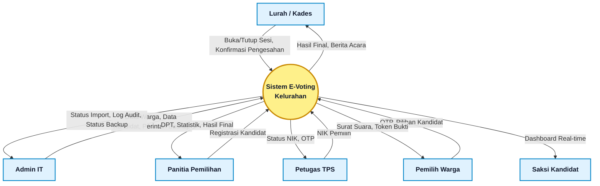
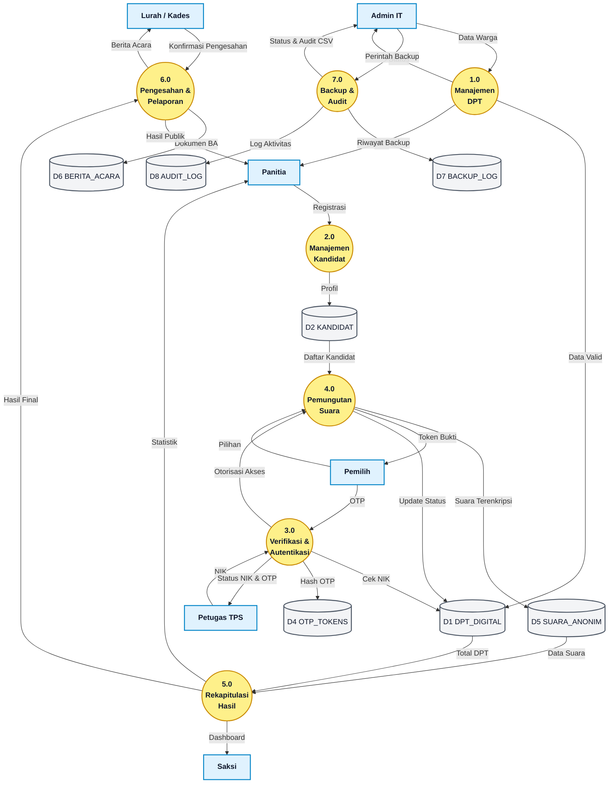

# Data Flow Diagram (DFD)
## Sistem Informasi E-Voting Tingkat Kelurahan

---

## 1. Diagram Konteks (Context Diagram)

Diagram Konteks merupakan level tertinggi dalam hierarki DFD yang menggambarkan sistem informasi e-voting sebagai **satu proses tunggal** yang berinteraksi dengan seluruh entitas luar (*external entities*). Diagram ini menunjukkan batasan sistem (*system boundary*) serta aliran data utama yang masuk dan keluar dari sistem.

### Entitas Luar (*External Entities*)

| No | Entitas Luar | Peran dalam Sistem |
|:--:|--------------|--------------------|
| 1 | **Lurah / Kepala Desa** | Penanggung jawab tertinggi pemilihan; membuka/menutup sesi pemilihan dan mengesahkan hasil resmi |
| 2 | **Admin IT** | Operator teknis yang mengelola infrastruktur sistem, mengimpor data DPT, dan melakukan backup |
| 3 | **Panitia Pemilihan** | Penyelenggara yang mendaftarkan kandidat dan memantau progres partisipasi pemilih |
| 4 | **Petugas TPS** | Verifikator lapangan yang memvalidasi identitas pemilih dan menghasilkan OTP |
| 5 | **Pemilih (Warga)** | Warga terdaftar di DPT yang memberikan suara melalui sistem |
| 6 | **Saksi Kandidat** | Pengawas dari utusan kandidat yang memantau hasil pemilihan secara *read-only* |

### Visualisasi Diagram Konteks

---

## 2. DFD Level 0

DFD Level 0 merupakan dekomposisi dari proses tunggal pada Diagram Konteks menjadi **tujuh proses utama** yang menggambarkan subsistem operasional di dalam Sistem Informasi E-Voting. Setiap proses dihubungkan oleh aliran data (*data flow*) dan berinteraksi dengan penyimpanan data (*data store*).

### Data Store (Tabel Database)

| ID | Data Store | Relasi ke ERD | Keterangan |
|:--:|------------|---------------|------------|
| D1 | DPT Digital | `DPT_DIGITAL` | Menyimpan data pemilih tetap (NIK, nama, status memilih) |
| D2 | Data Kandidat | `KANDIDAT` | Menyimpan profil pasangan calon (nomor urut, nama, foto) |
| D3 | Data Pengguna | `USERS` | Menyimpan akun seluruh aktor sistem dengan pembedaan role |
| D4 | Token OTP | `OTP_TOKENS` | Menyimpan hash OTP 6 digit beserta waktu kedaluwarsa |
| D5 | Suara Anonim | `SUARA_ANONIM` | Menyimpan hasil pilihan suara secara anonim |
| D6 | Berita Acara | `BERITA_ACARA` | Menyimpan dokumen hasil pemilihan yang telah disahkan |
| D7 | Backup Log | `BACKUP_LOG` | Menyimpan riwayat aktivitas pencadangan database |
| D8 | Audit Log | `AUDIT_LOG` | Menyimpan jejak seluruh aktivitas sensitif dalam sistem |

### Proses-Proses Utama

| ID | Nama Proses | Keterangan |
|:--:|-------------|------------|
| 1.0 | Manajemen DPT Digital | Pengimporan dan deduplikasi data pemilih dari CSV |
| 2.0 | Manajemen Kandidat | Pendaftaran dan pembaruan profil kandidat oleh Panitia |
| 3.0 | Verifikasi & Autentikasi | Validasi NIK dan pembuatan OTP hash |
| 4.0 | Pemungutan Suara | Autentikasi OTP, penyampaian e-ballot, dan pencatatan suara |
| 5.0 | Rekapitulasi & Hitung | Agregasi suara real-time untuk dashboard |
| 6.0 | Pengesahan & Laporan | Konfirmasi Lurah, penerbitan Berita Acara digital |
| 7.0 | Backup & Audit | Export log aktivitas dan pencadangan database |

### Visualisasi DFD Level 0

